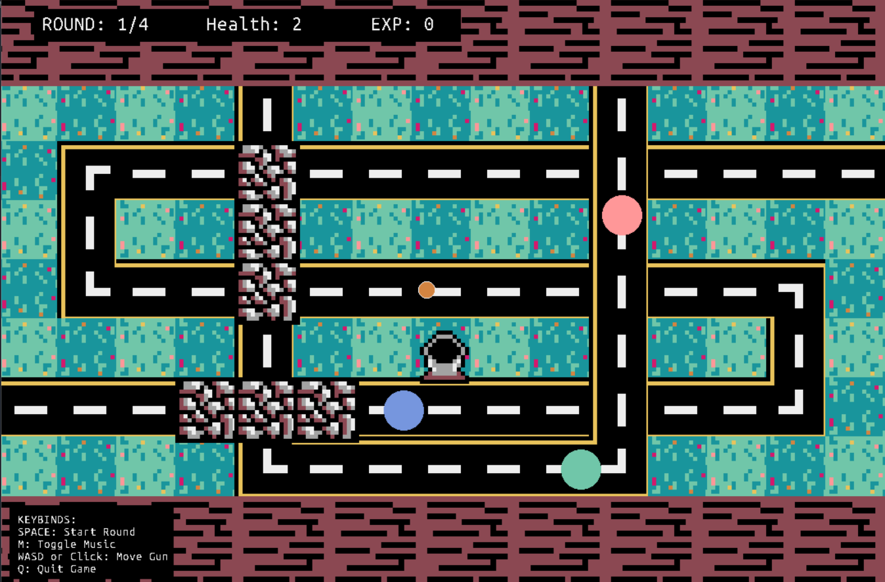
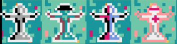

<h1 align="center">Zuma Tower Defense</h1>

## Mechanics

Have you ever played <a href="https://en.wikipedia.org/wiki/Zuma_(video_game)">Zuma</a> before? Now imagine that but with **tower defense** game mechanics in it! Pretty exciting and *challenging* right?

The goal of the game is pretty simple, just shoot all the enemies that you see! However, the color of your bullet must match the color of the enemy for it to disappear. Do note, that the color of your bullets is **random** and that you can shoot them for as many times as you wish. 

If ever you see a barricade or a **tunnel**, that implies that your bullet cannot pierce the enemy! They are like the **hiding spots** of our enemies.

### Keybinds
Listed below are the keybinds that will help you progress throughout the game:

| Keybind    | Action                                 | 
| :--------: | -------------                          |
| W          | Shoot bullet upwards                   |
| A          | Shoot bullet to the left               |
| S          | Shoot bullet downwards                 |
| D          | Shoot bullet to the right              |
| Left Click | Shoot bullet based on cursor location  |
| Space      | Start round                            |
| M          | Toggle on/off music                    |
| Q          | Quit game                              |

## Towers

    

If you want to place a tower, you must first obtain the necessary EXP to purchase it. Otherwise, you will not be able to place it. To purchase a tower, <b>hover over it and then right click</b>, the border should turn white (this is an indicator that you have selected a tower). Afterwards, select a slot to put it, voila, you have now a tower! You will encounter <b>four</b> different types of towers in this game.

### Basic Tower
This basic tower simply fires a single shot of a random color.
<i>Upgrade (5 EXP): Fires a burst of 2 shots</i>

### Sniper Tower
This tower fires more slowly, but it's shots can pierce up to 3 enemies of the same color!
<i>Upgrade (7 EXP): Bullets can now pierce 5</i>

### Splitter Tower
This tower fires more slowly, but it's shots split into 2 random colors when hitting the <b>wrong</b> colored enemy!
<i>Upgrade (10 EXP): Bullets now split into 3</i>

### Medic Tower
This tower doesn't fire at all, but it can <b> restore 1 HP </b> at the end of a round!
<i>Upgrade (12 EXP): It now restores 2!</i>

## Enemies
*Where's the fun if you keep shooting normal enemies amirite?* To make it more **fun and exciting** you will encounter five different type of enemies in this game! Now let's dive deeper into how they will behave in game and once you shoot them.

### Normal Enemy
This type of enemy behaves normally and may come in different colors. Nothing special going around here, boring...

### Regenerator
This type of enemy gains `+1 HP` when it has walked pass through 15 paths without being shot! 

### Chameleon
Similar to a chameleon, this enemy changes its color whenever it feels scared! 

### Bomber
Once you kill the bomber, you'll still be alive. However, **your EXP will decrement by 5**! Be careful to not shoot this fast beast! 

### Ninja
This type of enemy moves faster than your usual type of enemy. Shoot this bad boy and **gain 5 EXP**!

